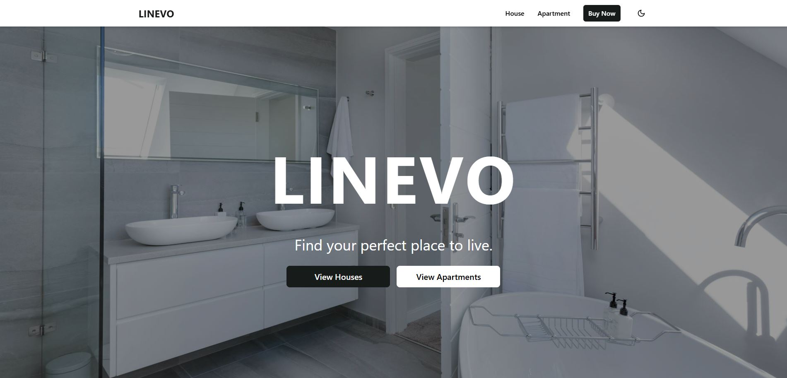
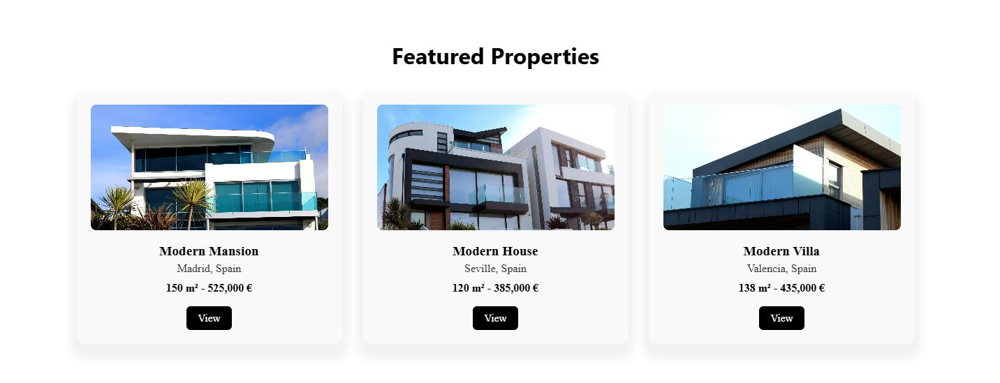
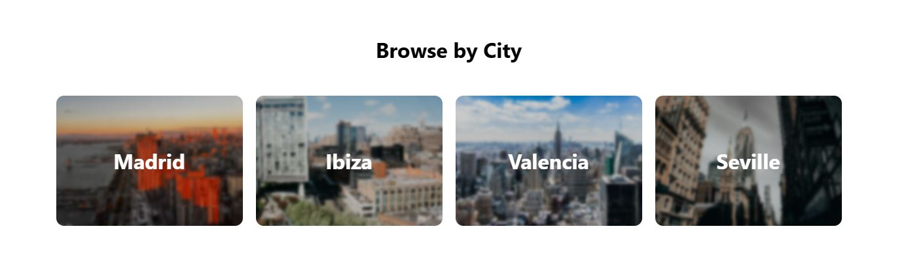
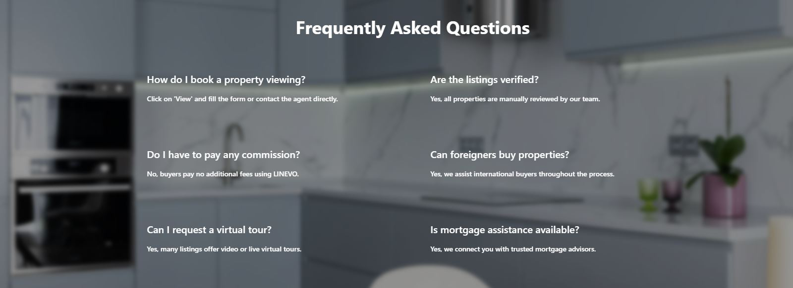
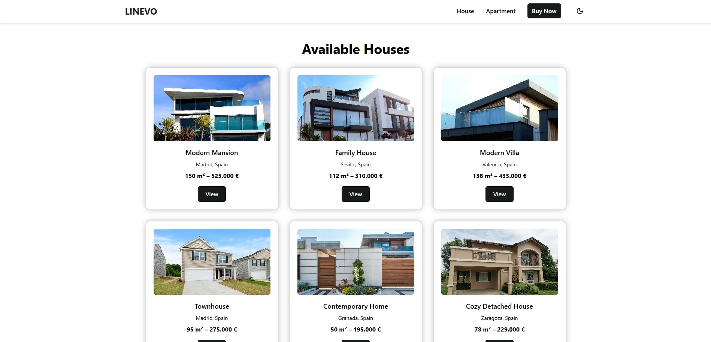
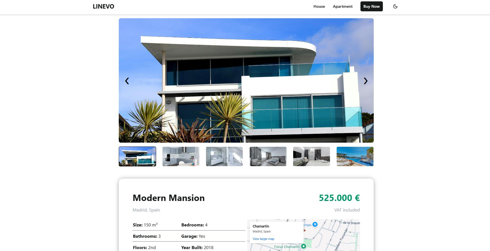
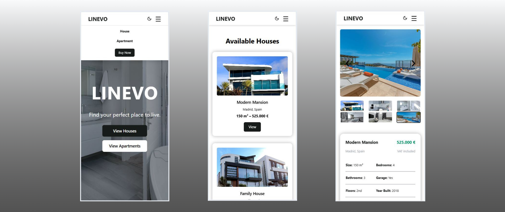

<body> 
    <h1>🏠 Property Listing Website  </h1>  
     
    
This real estate listing website, known as 'Linevo', is designed to help users explore property options when considering a purchase. The platform offers both houses and apartments, which can be browsed on dedicated pages. All properties are located in Spain, and users can easily search by city to narrow down their options. The site features highlighted listings, user feedback, ratings and reviews, all presented through a clean, modern, and highly user-friendly interface that ensures a smooth and engaging experience.

    <h2>Features</h2>
    <ul>
        <li>Modern, clean design</li>
        <li>Featured listings</li>
        <li>User reviews and ratings</li>
        <li>City-based search</li>
        <li>Frequently Asked Questions (FAQ)</li>
        <li>Newsletter subscription</li>
        <li>Grid layout</li>
        <li>Animated gallery for image transitions</li>
        <li>Google Maps integration</li>
        <li>Responsive design for all devices</li>
      </ul>   
    <h2>Tech Stack</h2>  
    
Front-End: ReactJS, Tailwind CSS, JavaScript
   
    <h2>Featured Listings</h2> 
        
    
Right after the hero section, the featured listings follow, immediately capturing the user's attention. The clean, minimalistic cards help users quickly get familiar with the layout, showing only the most important information. With the help of the button, users are directed to the detailed listing page for more information.
    

    <h2>User Feedback</h2>  
        
    
Following that, users can view reviews and feedback left by previous clients, which include star ratings and written comments. Each review also displays a name and location, helping to build trust and credibility with potential users.

    <h2>City Based Filter</h2>
    
    
Users have the option to filter properties based on city, allowing them to focus on their desired location — an especially useful feature when considering a real estate purchase. The most popular cities are showcased with a stylish blurred background image of each location, enhancing the overall visual design.

    <h2>Frequently Asked Questions</h2>
      
    
Potential buyers often have many questions in mind, which is why a Frequently Asked Questions (FAQ) section has been created. It aims to provide answers to the most commonly asked questions, allowing users to gain valuable information just by browsing the site — even before getting in touch directly.

    <h2>Newsletter Subscription</h2>
     
    
At the bottom of the page, in the footer section, users can find a newsletter subscription option. By entering their email address, they will receive updates about the real estate market — including new listings, removed or sold properties, and the appearance of newly added cities.

    <h2>Property Browse</h2>
    
    
When browsing available houses or apartments, users are directed to a dedicated listing page where properties are displayed using a Flexbox layout. Each property is shown in a card format, highlighting only the most important details to quickly capture the user's attention. Special focus has been placed on the use of animations throughout the page — key elements like buttons and property cards feature interactive effects when hovered over with the cursor, enhancing the overall user experience.

    <h2>Property Page</h2>
    
    
When a specific property is selected, the user is taken to the detailed view page, where all available information is presented as thoroughly as possible, including images and descriptions. One of the most important elements is the image gallery, which allows users to navigate between photos using left and right arrows or by clicking on the thumbnail images below. A subtle fade animation enhances the photo transitions for a smoother user experience.   
        Below the gallery, all essential property details are displayed, with the most important ones highlighted using larger font sizes. A table layout is used to make the information easier and quicker to understand. Additionally, an embedded Google Map helps users quickly locate the property, and a brief description provides further context about the area.

    <h2>Responsive Design</h2>
    
    
The website is, of course, fully responsive, ensuring that it looks and functions perfectly across all devices — something that's essential in today's digital world. The navigation bar features a dropdown menu on smaller screens, while the rest of the content is displayed in a vertical layout. Naturally, all features remain fully accessible and animated, just like on larger, horizontal devices.

    
    
    
